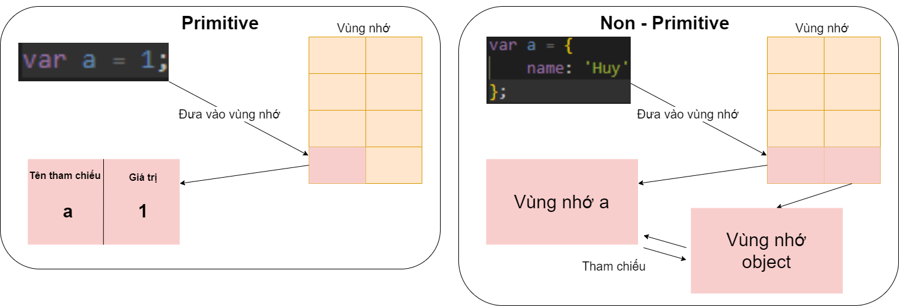
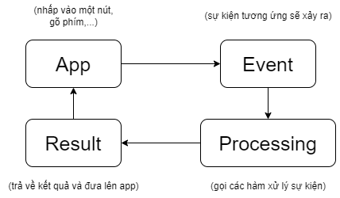

**Câu 1:**

- ***Primitive:***
  + Khi khai báo một biến, biến đó sẽ được đưa vào 1 vùng nhớ. Vùng nhớ này lưu trữ hai phần là tên tham chiếu và giá trị của biến.
  + Các DataType Primitive: **Number**, **String**, **Boolean**, **Null**, **Undefined**,...
  
- *Non-Primitive:* Khi khai báo một biến, biến đó sẽ đưa vào 2 vùng nhớ, một vùng nhớ có tên tham chiếu của biến vừa tạo, một vùng nhớ của object. Hai vùng nhớ này tham chiếu lẫn nhau.
  + Các DataType Non-Primitive: **Object**, **Array**, **Function**, **Date**, **Regx**,...
  
**Câu 2**
__Định nghĩa:__ Closure trong JavaScript là một tính năng cho phép một hàm truy cập và sử dụng các biến được khai báo trong phạm vi của hàm cha, ngay cả khi hàm cha đã kết thúc thực thi.
__Ví dụ:__
```
function sum(a, b){
    const c = a + b;
    return function() {
        console.log(c)
    };
}

sum(1, 2)();
```
Trong đoạn code trên, biến `c` nằm ở hàm cha `sum()`, hàm vô danh vẫn có thể truy cập đến biến `c` đó và thực thi `console.log`.

**Câu 3**
- **Event Driven:** một mô hình lập trình trong đó luồng thực thi của chương trình phụ thuộc vào các sự kiện xảy ra thay vì việc thực hiện tuần tự các lệnh từ đầu đến cuối.


- **Synchronus:** Đồng bộ. Chạy theo luồng, có tuần tự
    Cho ví dụ:
```
console.log(1)
console.log(2)
```
Theo tư duy đồng bộ, thì khi thực thi 2 câu lệnh trên thì `console.log(1)` sẽ hiển thị trước `console.log(2)`

- **Asynchronus:** Bất đồng bộ. Chạy bất thường
    Cho ví dụ:
```
setTimeout(function() {
    console.log(1);
},1000);

console.log(2);
```
Theo tư duy đồng bộ, đoạn code trên sẽ đợi 1s trước rồi thực thu `console.log(1)` rồi sau đó mới thực thi `console.log(2)`. Tuy nhiên với **bất đồng bộ**, thì `console.log(2)` sẽ được thực thi trước trong lúc đợi setTimeout rồi mới thực thi `console.log(1)`.

**Câu 4:** *Xem, thử code tại folder câu4*
```
function checkEmail(email) {
    var re = /^[^\s@]+@[^\s@]+\.[^\s@]+$/;
    var emailInput = document.getElementById("email").value;
    var label = document.getElementById("lbl_thongbao");

    if (re.test(emailInput)) {  //Kiểm tra một chuỗi có khớp với một biểu thức chính quy hay không.
        label.innerHTML = `<b>${emailInput}</b> là email hợp lệ`;
        label.style.color = "green";
        return true;
    } if (emailInput == "") {   //Trường hợp chưa nhập 
        label.innerHTML = "Vui lòng nhập email";
        label.style.color = "red";
        return false;
    } 
    else {  //Trường hợp không khớp
        label.innerHTML = `<b>${emailInput}</b> là email không hợp lệ`;
        label.style.color = "red";
        return false;
    }
}
```

**Câu 5:** *Xem, thử code tại folder câu5* (Tham khảo code chứ chưa hiểu lắm)
```
let nodes = [];

// Lấy các phần tử HTML
const idInput = document.getElementById('id-input');
const parentInput = document.getElementById('parent-input');
const submitButton = document.getElementById('submit-button');
const restartButton = document.getElementById('restart-button');
const resultElement = document.getElementById('result');
const label1 = document.getElementById('label1');
const label2 = document.getElementById('label2');

// Xử lý sự kiện khi nút "Submit" được nhấn
submitButton.addEventListener('click', () => {
  const id = idInput.value.trim();
  const parent = parentInput.value.trim();

  if (id !== '') {
    nodes.push({ id, parent });
    idInput.value = '';
    parentInput.value = '';
  } if (id == '' && parent == '') {
    label1.innerHTML = "Vui Lòng nhập id";
    label2.innerHTML = "Vui Lòng nhập parent";
  } else {
    resultElement.textContent = '';
  }
  renderTree();
});

// Xử lý sự kiện khi nút "Restart" được nhấn
restartButton.addEventListener('click', () => {
  nodes = [];
  resultElement.textContent = '';
  label1.innerHTML = "";
  label2.innerHTML = "";
});

// Hàm xây dựng cây
function buildTree(input) {
  const nodeMap = {};
  const rootNodes = [];

  input.forEach(node => {
    const { id, parent } = node;
    const newNode = { id, children: null };
    nodeMap[id] = newNode;

    if (parent === '0') {
      rootNodes.push(newNode);
    } else {
      const parentNode = nodeMap[parent];
      if (parentNode) {
        parentNode.children = parentNode.children || [];
        parentNode.children.push(newNode);
      }
    }
  });

  return rootNodes;
}

// Hàm hiển thị cây
function renderTree() {
  const tree = buildTree(nodes);
  resultElement.textContent = JSON.stringify(tree, null, 2);
}
```

**Câu6:** *Xem, thử code tại folder câu6*

- Câu6.1:   Chưa đúng yêu cầu

```
  setTimeout(function B(){
  var x = 'Hello';
  console.log('B');
  console.log(x);
  return x;
},3000)

function A(x){
  console.log('A');
  console.log(x);
}
A()
```

- Câu6.2:   Chưa đúng yêu cầu
```
setTimeout(function B(){
  // var x = document.getElementById("inputValue").value;
  var x = 10;
  console.log('B');
  try { 
    console.log(x + y)
  }
  catch (error) {
    console.log("Đã xảy ra lỗi: " + error.message);
  } finally {
    console.log("Đã thực thi code finally");
  }
  return x;
},3000)

function A(x){
  console.log('A');
  console.log(x);
}
A()
```

- Câu6.3:
```
function A(input, callback) {
    setTimeout(function() {
      const resultA = input * 2;
      document.write(`Function A: ${input} x 2 = ${resultA}<br>`);
      callback(resultA);
    }, 5000);
  }

  function B(input, callback) {
    const resultB = input * 2;
    document.write(`Function B: ${input} x 2 = ${resultB}<br>`);
    callback(resultB);
  }

  function C(input, callback) {
    const resultC = input * 2;
    document.write(`Function C: ${input} x 2 = ${resultC}<br>`);
    callback(resultC);
  }

  function D(input, callback) {
    const resultD = input * 2;
    document.write(`Function D: ${input} x 2 = ${resultD}<br>`);
    callback(resultD);
  }

  function E(input) {
    const resultE = input * 2;
    document.write(`Function E (cuối cùng): ${input} x 2 = ${resultE}<br>`);
  }

  function runProgram() {
    const inputValue = document.getElementById("inputValue").value;
    
    A(parseInt(inputValue), function(resultA) {
      B(resultA, function(resultB) {
        C(resultB, function(resultC) {
          D(resultC, function(resultD) {
            E(resultD);
          });
        });
      });
    });
  }
```